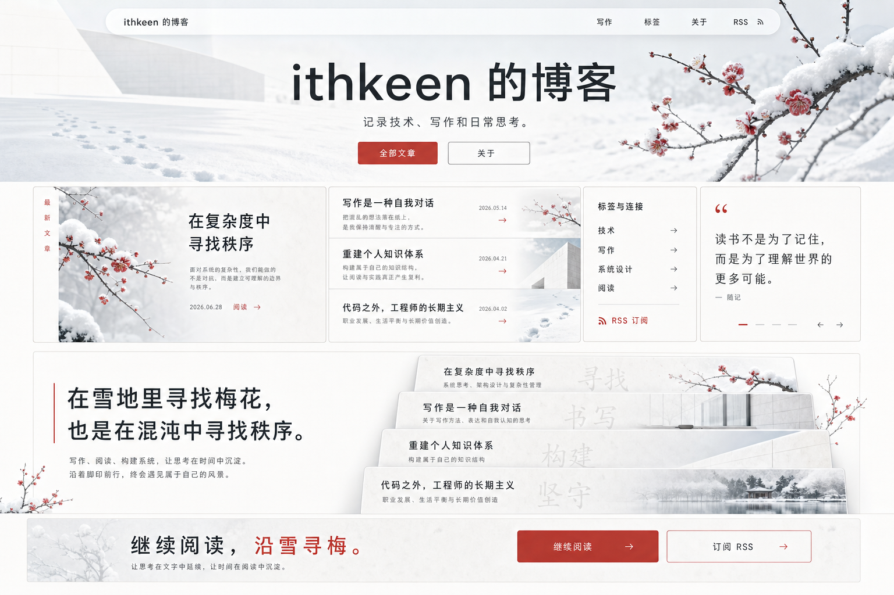

# Personal blog design

## Context

This repository is currently a minimal scaffold with `README.md`, `LICENSE`,
and contributor guidance in `AGENTS.md`. The first implementation should turn it
into a personal writing-focused blog without adding unnecessary product,
portfolio, dashboard, comment, or CMS scope.

The selected direction is:

- Site title: `ithkeen 的博客`
- Primary language: Chinese
- Publishing target: GitHub Pages project site at `/blog/`
- Technology stack: Astro with Markdown/MDX content
- Content source: files committed to the repository
- Visual direction: `踏雪寻梅`, an expressive light editorial blog
- First release scope: writing MVP with a strong visual system
- Taxonomy: tags only

Reference concept:



## Design read

Read this as a personal editorial blog for Chinese technical readers, with a
poetic but precise `踏雪寻梅` visual language. The design should feel like walking
through snow to find plum blossoms: white space, cold mist, graphite ink,
footstep traces, and a restrained plum-red accent. It should not feel like a
generic minimal blog, a dark cinematic portfolio, or a SaaS landing page.

Use the approved `gpt-taste` direction:

- Hero architecture: cinematic center.
- Typography stack: Cabinet Grotesk-inspired Latin/UI rhythm, with a strong
  modern Chinese system font stack.
- Component architecture: horizontal accordions, inline typography images, and a
  reading-note carousel.
- Motion architecture: card stacking and scrubbed text reveals.
- Page structure: AIDA, with Navigation, Attention, Interest, Desire, and Action.

## Goals

Build a static personal blog that is easy to write for, easy to deploy, and
pleasant to read, while giving the site a memorable visual identity from the
first release.

The blog should support:

- A cinematic home page with a short personal introduction and recent posts.
- A complete post list sorted by publication date.
- Individual article pages generated from Markdown or MDX.
- Tags and tag-specific article lists.
- A short about page.
- RSS output.
- Basic SEO metadata and sitemap generation.
- GitHub Pages deployment from the default branch.
- Reduced-motion fallbacks for all motion-heavy areas.

## Non-goals

The first release will not include:

- Full-text search.
- Dark mode.
- Comments.
- Analytics.
- A custom CMS or admin panel.
- Categories in addition to tags.
- Series pages, reading progress bars, or advanced article navigation.
- A portfolio-first home page.
- Newsletter forms, email capture, social proof logos, fake metrics, or avatars.

These can be added later without changing the core content model.

## Architecture

The project will use Astro as a static site generator. Content will live in
`src/content/blog/`, and Astro content collections will validate post metadata
at build time.

Expected structure:

```text
src/
  components/
  content/
    blog/
  layouts/
  pages/
    index.astro
    about.astro
    posts/
    tags/
  styles/
public/
```

Astro should be configured for the GitHub Pages project site at
`https://ithkeen.github.io/blog/`:

- `base: "/blog"`
- `site: "https://ithkeen.github.io"`

The `site` value can be changed later if the blog moves to a custom domain.
Page and asset links should use Astro's routing helpers or configuration-aware
paths so the `/blog/` base path works consistently.

Most pages should remain static Astro output. Motion-heavy sections should be
isolated client-side islands so the article reading experience stays fast and
stable.

## Routes

The first release should expose these routes:

- `/blog/`: home page with hero, recent posts, tags/RSS utility, and action CTA.
- `/blog/posts/`: all published posts, newest first.
- `/blog/posts/<slug>/`: article detail page.
- `/blog/tags/`: list of tags with post counts.
- `/blog/tags/<tag>/`: posts for one tag.
- `/blog/about/`: short about page.
- `/blog/rss.xml`: RSS feed.
- Sitemap output generated by Astro sitemap integration.

## Content model

Each blog post will be a Markdown or MDX file under `src/content/blog/`.
The file path determines the slug. For example,
`src/content/blog/hello-world.md` should publish to
`/blog/posts/hello-world/`.

Frontmatter fields:

```yaml
title: "文章标题"
description: "一段简短摘要"
pubDate: 2026-07-02
updatedDate: 2026-07-02
tags:
  - 技术
draft: false
```

Required fields:

- `title`
- `description`
- `pubDate`
- `tags`

Optional fields:

- `updatedDate`
- `draft`

Rules:

- `tags` must be an array of strings.
- Published pages, tag pages, and RSS should use the same filtered post list.
- `draft: true` posts should not be published in production.
- Draft posts may still be previewed during local development.

## Visual system

The page theme is light-only for the MVP. It should feel snowy, cold, precise,
and editorial.

Core tokens:

- Background: snow white and cold blue-white surfaces.
- Text: graphite or ink charcoal.
- Muted text: cool gray.
- Accent: one muted plum red used for CTAs, active states, and a small number of
  visual traces.
- Borders: thin graphite or icy gray hairlines.
- Texture: subtle grain/frost, implemented as a fixed non-interactive overlay or
  background image.
- Radius: one consistent small-to-medium radius system. Nav and buttons may use
  pill geometry; cards and content panels should use softly squared corners.

Typography:

- Use a Cabinet Grotesk-inspired wide sans-serif direction for Latin/UI rhythm.
- Use a strong Chinese system stack such as `PingFang SC`, `Microsoft YaHei`,
  `Noto Sans CJK SC`, and `sans-serif`.
- Do not use Inter as the default visual personality.
- Hero H1 must use a wide container and stay within 2 visual lines on desktop.
- Article reading width should remain comfortable, roughly `680px` to `760px`.
- Dates and small metadata may use a mono style, but only where it clarifies
  structure.

Imagery:

- Use snow, plum branch, pale architectural winter light, paper, and footsteps as
  the image vocabulary.
- The first implementation may use generated assets or stable seeded remote
  images, but production assets should be stored under `public/` or another
  documented asset location.
- Do not use labels over images.
- Do not use fake photo-credit captions.
- Do not use generic stock imagery that breaks the `踏雪寻梅` mood.

Forbidden visual patterns:

- Dark cinematic theme.
- Generic white minimal blog.
- Beige/brass craft palette.
- AI-purple gradients.
- Neon glow or bokeh blobs.
- Decorative status dots.
- Version labels.
- Cheap meta labels such as `SECTION 01`, `ABOUT US`, or `QUESTION 05`.
- Hero badges, hero tag pills, or raw stats.
- Social proof logos, fake reader faces, or newsletter email inputs.

## Page design

### Home page

The home page follows AIDA.

Navigation:

- A premium floating frost-glass light nav sits over the snow-field hero.
- It must stay one line on desktop and remain under `80px` tall.
- Links: `写作`, `标签`, `关于`, `RSS`.
- Active and hover states use plum red or ink underline, not decorative dots.

Attention:

- Hero H1: `ithkeen 的博客`.
- Hero subtext: `记录技术、写作和日常思考。`
- Exactly two hero CTAs: `全部文章` and `关于`.
- The hero uses a wide, centered composition over a snow/plum visual field.
- The H1 must use an ultra-wide container such as `max-width: 72rem` or wider.
- No badge, no stamp, no tag pills, no stats, no scroll cue.

Interest:

- Use a gapless bento grid with exactly 5 cells.
- The desktop bento should be planned as a 12-column, 6-row grid.
- Cell allocation should fill the grid without dead corners, for example:
  `24 + 18 + 12 + 9 + 9 = 72` grid units.
- Use `grid-auto-flow: dense` or an equivalent explicit CSS grid layout.
- Cell types:
  - Large featured article with snowy plum imagery.
  - Horizontal accordion-like article slices.
  - Tags and RSS utility.
  - Dense typography note.
  - Reading-note carousel with typography only, no faces.

Desire:

- Include a stacking article-card section.
- Cards should feel like pale paper sheets rising from snow.
- Add a scrubbed text reveal section about writing, systems, reading, and
  patience.
- Motion must be implemented with GSAP and reduced-motion fallbacks.
- No numeric pagination or section-number labels.

Action:

- Massive footer CTA text: `继续阅读，沿雪寻梅。`
- Footer actions: `继续阅读` and `订阅 RSS`.
- RSS is a link, not a form.
- Footer includes the site title and core links.

### Posts page

The posts page should preserve the `踏雪寻梅` identity without repeating the home
hero.

- Use a large title `全部文章`.
- Render posts grouped by year or as a refined chronological index.
- Tags can appear as compact filters above the list.
- Rows should show date, title, description, and tags.
- Avoid heavy card grids for the archive. The archive should read like a precise
  walking trail through writing.
- Empty state copy: `还没有发布的文章。`

### Tag pages

Tag pages reuse the posts index language.

- `/tags/` lists all tags with post counts.
- `/tags/<tag>/` shows the same refined index filtered by tag.
- Active tag state uses plum red and high-contrast text.
- Tag links must remain keyboard focusable and screen-reader clear.

### Article page

Article pages should be calmer than the home page.

- The article title should be large but not theatrical.
- Metadata includes date and tags.
- Reading column width stays around `680px` to `760px`.
- Optional side rail can show tags, publish date, and a short table of contents
  on desktop.
- The side rail collapses below the title metadata on mobile.
- Code blocks use a light or ink-on-light treatment that fits the snow theme.
- Blockquotes use typography and a plum-red rule, not card decoration.
- Previous/next navigation appears as simple high-contrast rows.

### About page

The about page should be short and writing-focused.

- Explain what the blog records: technology, writing, and daily thinking.
- Avoid portfolio case studies or resume-style project grids.
- Use one optional snow/plum image or typographic panel if it strengthens the
  page, but do not invent identity claims.

## Components

The component set should stay small but more visually deliberate than a basic
journal.

- `BaseLayout`: common HTML shell, metadata, site title, global styles, and
  texture layer.
- `Header`: floating light navigation and responsive nav behavior.
- `Footer`: large CTA and supporting links.
- `HomeHero`: centered snow/plum hero with two CTAs.
- `HomeBento`: gapless 5-cell bento grid.
- `ArticleStack`: GSAP card stacking client island.
- `TextReveal`: GSAP scrubbed text reveal client island.
- `PostList`: shared list rendering for home, archive, and tag pages.
- `PostCard`: article summary with title, date, description, and tags.
- `TagList`: reusable tag links.
- `FormattedDate`: consistent Chinese date formatting.

SEO metadata can start inside `BaseLayout`. If metadata grows more complex, it
can be extracted into a dedicated component later.

## Motion and interaction

Motion is part of the approved direction, but it should not harm reading.

Required motion:

- Hover physics on clickable cards and image surfaces, limited to transform and
  opacity.
- Card stacking in the home page desire section.
- Scrubbed text reveal in the home page desire section.
- Subtle nav and button hover states.

Implementation rules:

- Use GSAP with `ScrollTrigger` for scroll-bound effects.
- Isolate GSAP code in client islands.
- Clean up all GSAP contexts on unmount.
- Respect `prefers-reduced-motion`.
- In reduced motion, render the same content statically with no pinned or scrubbed
  movement.
- Prevent horizontal overflow by wrapping the main page surface with
  `overflow-x: hidden` or an equivalent class.

Do not animate layout properties such as width, height, top, or left.

## Data flow

Pages will use `getCollection("blog")` to load posts. A shared utility should
filter and sort posts so home, list, tag, and RSS pages use consistent behavior.

Expected helper behavior:

- Filter out production drafts.
- Sort by `pubDate` descending.
- Return all unique tags with counts.
- Return posts for a specific tag.

The home page should render a small recent-post subset, plus enough post data to
populate the bento and stacking sections. The posts page should render all
published posts.

## Error handling

Most errors should fail during build:

- Missing required frontmatter should fail content collection validation.
- Invalid `tags` values should fail validation.
- Invalid dates should fail validation.

Runtime static pages should handle empty content gracefully:

- If there are no published posts, the home and posts pages show an empty state.
- Tag pages should only be generated for tags that exist in published content.
- RSS should emit the same published posts as the public site.
- Motion islands should not hide content if JavaScript fails.

## Deployment

Deployment should use GitHub Actions for GitHub Pages:

1. Install dependencies with `npm ci`.
2. Run the validation command.
3. Build the Astro site.
4. Publish `dist/` through GitHub Pages.

The repository should ignore generated and local-only files:

- `node_modules/`
- `dist/`
- `.astro/`
- `.superpowers/`

`README.md` and `AGENTS.md` should be updated during implementation with the
actual install, development, check, build, and preview commands.

## Testing and verification

The first release will rely on build-level validation and manual visual checks.

Required commands after implementation:

- `npm run check` validates Astro types and content collections.
- `npm run build` verifies all static output, RSS, and sitemap generation.
- `npm run preview` supports manual review of home, posts, tag, about, and RSS
  paths.

Manual verification:

- Home page matches the approved `踏雪寻梅` concept direction.
- Desktop hero H1 stays within 2 visual lines.
- Desktop nav stays one line and under `80px`.
- Bento grid has no empty cells or broken corners.
- Article stack and text reveal work without causing horizontal scroll.
- Reduced motion renders static content.
- Mobile layouts collapse into a readable single-column flow.
- Article pages maintain comfortable reading width and line height.
- RSS route and sitemap are generated.

No automated browser test suite is required for the MVP. If later changes add
interactive behavior beyond the approved motion islands, tests should be added
around those behaviors.

## Implementation notes

The implementation should preserve unrelated working tree changes. Existing
untracked files such as `AGENTS.md` and `.gitignore` should not be overwritten or
staged unless the user asks for that explicitly.

The first implementation plan should start by scaffolding the Astro project and
then add content collections, routes, styling tokens, visual assets, GSAP motion
islands, RSS, sitemap, and deployment in small verifiable steps.
